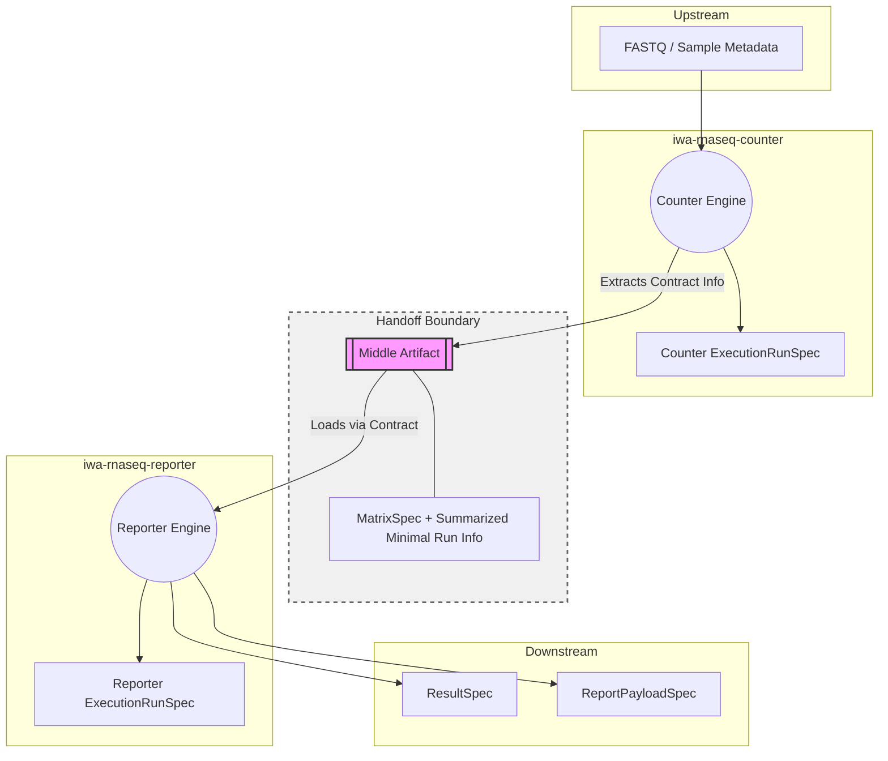

# RNA-Seq Suite Minimal Workflow
Version: draft-0.1

## 1. Purpose
この文書は、RNA-Seq Suite におけるデータ処理の最小ワークフロー `FASTQ -> Counter -> Middle Artifact -> Reporter -> Result / Payload` を図解および言語化し固定するものです。
最大の目的は、アプリ間（Counter と Reporter 等）での**内部実装の直接的な相互依存・相互汚染を防止**することであり、境界線をまたぐ接点としての「Middle Artifact の責務」を定義することにあります。

## 2. Workflow Principles
- **Contract by Middle Artifact**: 異なるアプリは直接通信せず、すべて中間に配置された Artifact（契約）を介してデータを引き渡す。
- **Anti-Contamination Rule**: 実行ツール側の内部事情を解析ツールが知る必要はなく、解析ツール側の事情を実行ツールが知る必要もない。情報のフィルタリングと汚染除去は Middle Artifact が担保する。
- **No Shared Mutable Truth**: スイート全体で共有する「一枚岩の大きな実行ログ」を持たず、各アプリは自身の実行責任範囲に閉じた `ExecutionRunSpec` を持つ。

## 3. Minimal Workflow Overview

## 4. Primary Workflow
### 4.1 FASTQ to Counter
- **入力ソース:** ベンダー提供の FASTQ ファイルと生サンプルメタデータ。
- **処理:** Counter に取り込まれ、定量的解析（アライメント、カウント等）が行われる。

### 4.2 Counter to Middle Artifact
- **出力ソース:** Counter の実行終了後。
- **処理:** Counter は内部の `ExecutionRunSpec` を Reporter に直接渡すのではなく、必要な Handoff 情報だけを抽出し、`MatrixSpec` 等の明確な Core Spec にまとめ、**Middle Artifact (Handoff Bundle)** として出力する。

### 4.3 Middle Artifact to Reporter
- **入力ソース:** Middle Artifact のみ。
- **処理:** Reporter は Counter の物理的な実行ディレクトリや Counter のパッケージモジュールには一切アクセスせず、純粋な Schema Conventions に従った Middle Artifact だけをインプットとして読み込む。

### 4.4 Reporter to ResultSpec / ReportPayloadSpec
- **出力ソース:** Reporter による DEG・統計解析終了後。
- **処理:** 統計結果としての完全な真実 `ResultSpec` と、ビューや帳票向けの `ReportPayloadSpec` を生成し出力する。

## 5. Middle Artifact Responsibilities
Middle Artifact は、単にデータを詰めるための「何でも箱 (Convenience Box)」ではありません。以下の**境界防御責務 (Boundary Defense)** を負います。
1. **アプリ間の直接依存の遮断:** Counter の出力構造が将来内部で変わっても、Reporter が壊れないようにする。
2. **汚染の除去:** Counter が持つ固有の巨大な実行パラメータ群（ツールやコンテナの生ログ、一時パス）をフィルタリングし、Reporter が知るべき必要な Minimal Run Info に変換（または分離）して繋ぐ。
3. **Portability の保証:** 環境依存のローカル絶対パスを剥がし、全て Relative / URI ベースで解決可能な形にする。

## 6. ExecutionRunSpec Handling Principles
`ExecutionRunSpec` は provenance と lineage を担う重要な Spec ですが、扱いを誤ると巨大な相互汚染の温床になります。

### 6.1 Counter-side Run Record
- Counter は入力された FASTQ から Matrix を生成するまでの、プロセス単位の詳細な `ExecutionRunSpec` を作成し保持してよい。

### 6.2 Reporter-side Run Record
- Reporter も独自に、どの Matrix と何の設定を使って計算し Output を生んだかを証明する `ExecutionRunSpec` を作成し保持してよい。

### 6.3 Anti-contamination Rule (相互汚染の禁止)
- **一枚岩の共有資産にしない:** Counter が出力した `ExecutionRunSpec` に対して、Reporter が後から自分たちの実行結果や解析仕様を「上書き・追記」してはいけない。
- App 間で相手の `ExecutionRunSpec` の全フィールドスキーマを完全に理解・共有する必要はない。内部情報を直結するのは厳禁。

### 6.4 Middle Artifact Aggregation Rule
- 双方の Provenance を繋ぐ（例：この Reporter の結果は、どの Counter の実行由来か？）目的の Lineage 接続は、**Middle Artifact 経由**で行う。Reporter は Counter の "Identity References (ID等)" などを保持し参照するのみとする。

## 7. Allowed Workflow Patterns
- `FASTQ -> Counter -> (MatrixSpec + 抽象化された Run Info を含む Middle Artifact) -> Reporter`
- `Vendor CSV -> Adapter -> (Normalized Middle Artifact) -> Reporter`
- 中間成果物（Middle Artifact）を介した Lineage（履歴的接続）の構築。

## 8. Forbidden Workflow Patterns
- **[Forbidden]** Reporter が Counter 内部の `ExecutionRunSpec` の JSON に直接アクセスし、内容を深掘りして読み込むこと。
- **[Forbidden]** Reporter が Counter の内部解析都合である `tx2gene` などの生パスを Contract 経由せず直接知ろうとすること。
- **[Forbidden]** App 間で Middle Artifact を飛ばして相互のパッケージ・関数を直接 `import` してデータを受け渡すこと。
- **[Forbidden]** ワークフロー図の接続の便宜のために、DBへの汚染をもたらすような「新しい独自の Truth」を一時的に作ること。
- **[Forbidden]** Workflow Contract 内部に、特定ホストに依存した絶対パス (Absolute Path) を持ち込むこと。

## 9. Current Implementation Reality / Known Coupling Risks
現時点での実装において、本アーキテクチャの理想に対して**重篤な既知のリスク (Known Boundary Conflict)** が存在しています。
- `iwa_rnaseq_reporter/src/iwa_rnaseq_reporter/io/bundle_loader.py` において、`iwa_rnaseq_counter` のパッケージ (`read_analysis_bundle`) を直接 `import` しており、Reporter が Counter の内部パース事情に直接依存しています。
- 「パッケージレベルの疎結合」が未達成であり、Reporter は現在 Counter のコードがないと自立して Middle Artifact を読むことができません。
- **B20-04 ではこれらは「解消」されず、将来バッチにおける技術的負債としての「明文化」にとどめます。**

## 10. Follow-up Items After B20-04
- Middle Artifact（現在の Bundle に相当するもの）の物理ファイル配置と、`analysis_bundle_manifest.json` のリファクタリング。
- `Source Artifact Identity` の各 Spec および Handoff への組み込み詳細。
- `ExecutionRunSpec` 内部の厳密な Required Field 決定と Pydantic 実装。

## 11. B20-04 Done Definition
- [x] FASTQ から Report までの Minimal Workflow が図示されている。
- [x] Middle Artifact が「責務の吸収・分離点」として明確に定義されている。
- [x] `ExecutionRunSpec` を App 別に保持する原則が明記され、相互汚染の禁止が断言されている。
- [x] 現状のコードベースに残る依存リスク (`bundle_loader` 等) が Known Conflict として記録されている。
- [x] ソースコードは改変されていない。
